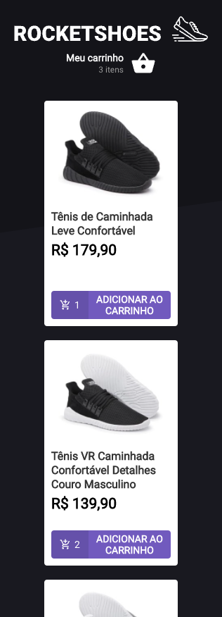
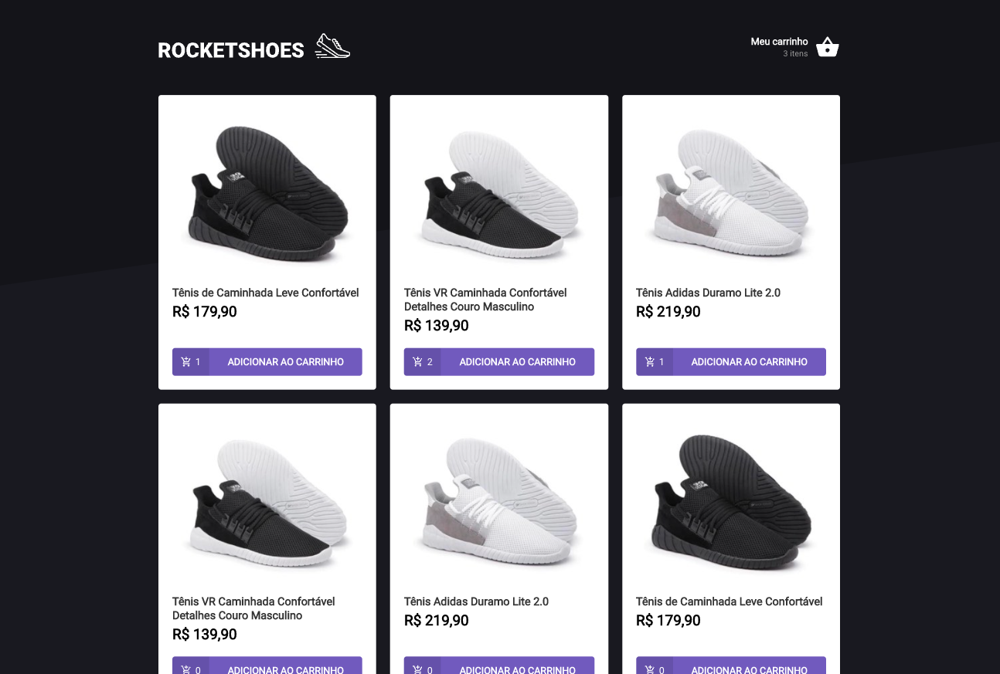

# ignite-reactjs-criando-um-hook-de-carrinho-de-compras

## Sobre o Desafio ##

O principal objetivo é criar um hook de carrinho de compras. Implementar as seguintes funcionalidades:

- Adicionar um novo produto ao carrinho;
- Remover um produto do carrinho;
- Alterar a quantidade de um produto no carrinho;
- Cálculo dos preços sub-total e total do carrinho;
- Validação de estoque;
- Exibição de mensagens de erro.

<h2>Tecnologias 💻 </h2>

HTML5 - ReactJS - TypeScript
Fake API com JSON Server
Preservar os dados do carrinho com localStorage API
Mostrar erros com toastify
Modelo responsivo

<h2>Layout Mobile e Desktop</h2>

      
    

